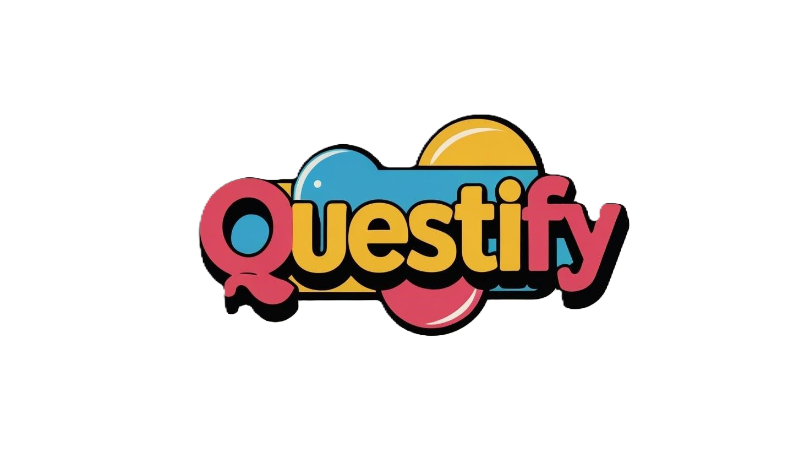

<p align="center">
  
</p>

# Questify - Q&A Platform

Questify is a full-stack Q&A Platform built with Next.js, Prisma, and NextAuth. It is a personalized Q&A platform where users can register, log in, post questions, answer, discuss, and interact with content through upvotes and downvotes. The app features a responsive UI/UX for seamless navigation across devices.

---

## Demo

- **Live App:** [https://questify-five.vercel.app/](https://questify-five.vercel.app/)
- **GitHub Repo:** [https://github.com/itzDeepansu/questify](https://github.com/itzDeepansu/questify)

---

## Tech Stack

- **Frontend:** Next.js, React, Tailwind CSS, React Hook Form
- **Backend:** Next.js API Routes, Prisma ORM, PostgreSQL (or your DB)
- **Authentication:** NextAuth.js
- **State/Context:** React Context, Toast Notifications

---

## Features

- **User Authentication:**  
  Register and log in with secure authentication using NextAuth.

- **Personalized Home Feed:**  
  See a feed of questions, answers, and discussions tailored to your interests.

- **Ask & Answer Questions:**  
  Post new questions and provide answers to help the community.

- **Discussions:**  
  Engage in discussions on questions with threaded comments.

- **Upvote/Downvote:**  
  Upvote or downvote answers and discussions to surface the best content.

- **Topic Browsing:**  
  Explore questions by topics and follow your interests.

- **User Profiles:**  
  View and edit your profile, see your questions, answers, and discussions.

- **Search:**  
  Find relevant questions and topics easily with the search feature.

- **Responsive Design:**  
  Enjoy a seamless experience on desktop and mobile devices.

---

## Folder Structure

```
app/
  api/                # API routes (Next.js Route Handlers)
    answer/           # Answer-related endpoints
    auth/             # NextAuth authentication
    discussion/       # Discussion endpoints
    notifications/    # Notification endpoints
    question/         # Question endpoints
    register/         # Registration endpoint
    topic/            # Topic endpoints
    user/             # User endpoints
  (pages)/            # App pages (login, signup, question, topic, users, etc.)
  components/         # Reusable UI components (Navbar, Postquestion, etc.)
  generated/          # Generated files (e.g., Prisma client)
  globals.css         # Global styles
  layout.tsx          # Root layout
  providers.tsx       # Context providers (Session, Auth, Toast)
  page.tsx            # Home page (feed)
public/
  questify_logo.png   # Project logo
```

---

## Key Files

- [`app/page.tsx`](app/page.tsx): Home page with questions feed, posting, and topic bar.
- [`app/providers.tsx`](app/providers.tsx): Wraps the app with authentication, session, and toast providers.
- [`app/(pages)/login/page.tsx`](<app/(pages)/login/page.tsx>): Login page.
- [`app/(pages)/signup/page.tsx`](<app/(pages)/signup/page.tsx>): Signup page.
- [`app/(pages)/question/[slug]/page.tsx`](<app/(pages)/question/[slug]/page.tsx>): Individual question page with answers and discussions.
- [`app/(pages)/topic/page.tsx`](<app/(pages)/topic/page.tsx>): Topics listing.
- [`app/(pages)/users/self/[slug]/page.tsx`](<app/(pages)/users/self/[slug]/page.tsx>): User profile and settings.

---

## Getting Started

1. **Clone the repository:**

   ```sh
   git clone https://github.com/itzDeepansu/questify
   cd questify
   ```

2. **Install dependencies:**

   ```sh
   npm install
   ```

3. **Set up environment variables:**  
   Create a `.env` file with your database and NextAuth credentials.

4. **Run database migrations:**

   ```sh
   npx prisma migrate dev
   ```

5. **Start the development server:**

   ```sh
   npm run dev
   ```

6. **Visit [http://localhost:3000](http://localhost:3000) to use the app.**

---
